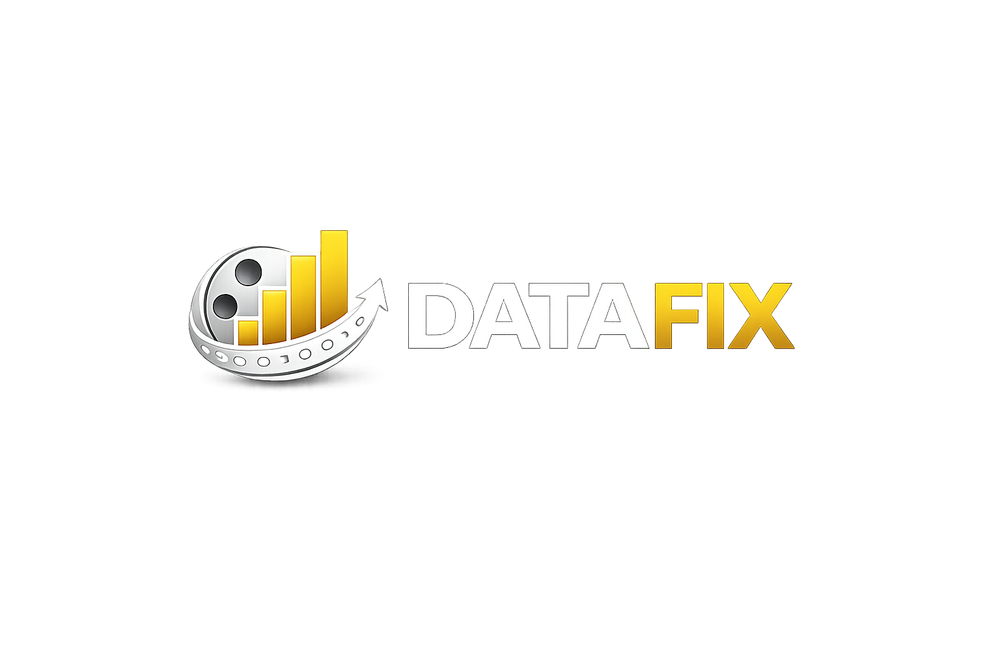

# 🎬 DATAFIX – Application Streamlit

> Système de recommandation **spécialisé en comédie française post-1980** (note ≥ 6.5/10),
> conçu pour le futur cinéma indépendant de la **Creuse**.
> Projet Sprint 4 – formation Data Analyst.



## ✨ Fonctionnalités

- 🏠 **Accueil** – présentation du projet et du moteur.
- 🎯 **Recommandation** – sélectionnez un film, recevez 8 propositions similaires (TF-IDF + cosine similarity).
- 📊 **Statistiques** – répartition par genre, par décennie, top 10 des films les mieux notés.
- ℹ️ **À propos** – équipe, méthode, stack technique.

## 🚀 Démarrage rapide

```bash
# 1) Cloner et entrer dans le projet
git clone https://github.com/<votre-org>/DATAFIX-Streamlit.git
cd DATAFIX-Streamlit

# 2) Créer et activer un environnement virtuel
python -m venv .venv
# Windows :
.venv\Scripts\activate
# macOS / Linux :
source .venv/bin/activate

# 3) Installer les dépendances
pip install -r requirements.txt

# 4) (Optionnel) Configurer la clé API TMDB
cp .streamlit/secrets.toml.example .streamlit/secrets.toml
# puis éditer le fichier et coller votre clé

# 5) Lancer l'application
streamlit run app.py
```

L'application s'ouvre par défaut sur <http://localhost:8501>.

## 📁 Arborescence

```
DATAFIX-Streamlit/
├── app.py                    # Point d'entrée Streamlit
├── pages/                    # Pages multi-niveaux (auto-détectées)
│   ├── 1_🏠_Accueil.py
│   ├── 2_🎯_Recommandation.py
│   ├── 3_📊_Statistiques.py
│   └── 4_ℹ️_À_propos.py
├── utils/                    # Logique métier
│   ├── theme.py              # CSS DATAFIX (noir/jaune)
│   ├── data_loader.py        # Chargement du catalogue
│   ├── tmdb_api.py           # Wrapper API TMDB
│   └── recommender.py        # Moteur TF-IDF + cosine
├── assets/                   # Logo, bannières
├── data/                     # Datasets (non versionnés)
├── .streamlit/
│   ├── config.toml           # Thème Streamlit
│   └── secrets.toml.example  # Modèle pour la clé API
├── requirements.txt
├── .gitignore
└── README.md
```

## 🎨 Charte visuelle

| Élément       | Valeur          |
| ------------- | --------------- |
| Fond principal| `#0E0E10`       |
| Couleur primaire | `#F5C518` (jaune DATAFIX) |
| Texte         | `#F5F5F5`       |
| Cartes        | `#16161A`       |

## 📊 Données

L'application accepte deux modes :

1. **Mode démo** (par défaut) : un échantillon de 20 films connus est embarqué dans `utils/data_loader.py`. Aucune donnée externe nécessaire.
2. **Mode production** : déposer dans `data/` un fichier `movies_final.csv` issu de la fusion IMDb + TMDB de l'équipe. Colonnes attendues : `tmdb_id, title, year, genres, overview, poster_path, vote_average, vote_count`.

## 🛠️ Stack

- **Python 3.10+**
- **Streamlit 1.33+**
- **Pandas / NumPy**
- **scikit-learn** (TF-IDF, cosine similarity)
- **TMDB API** (affiches officielles)

## 📜 Licence

Projet pédagogique – usage non commercial. Données issues d'IMDb et TMDB
sous leurs licences respectives.
